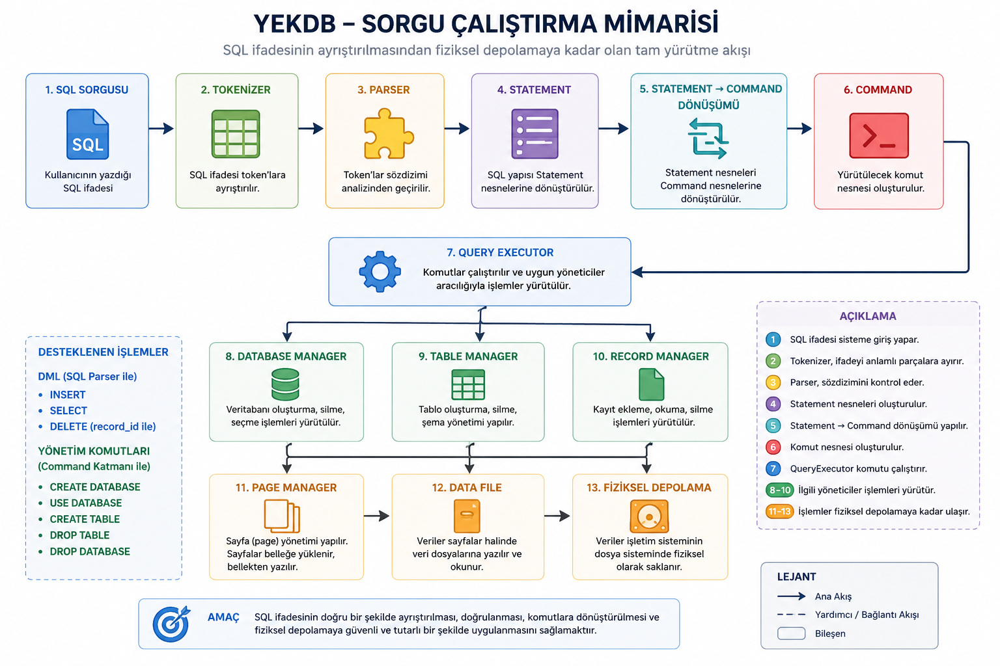
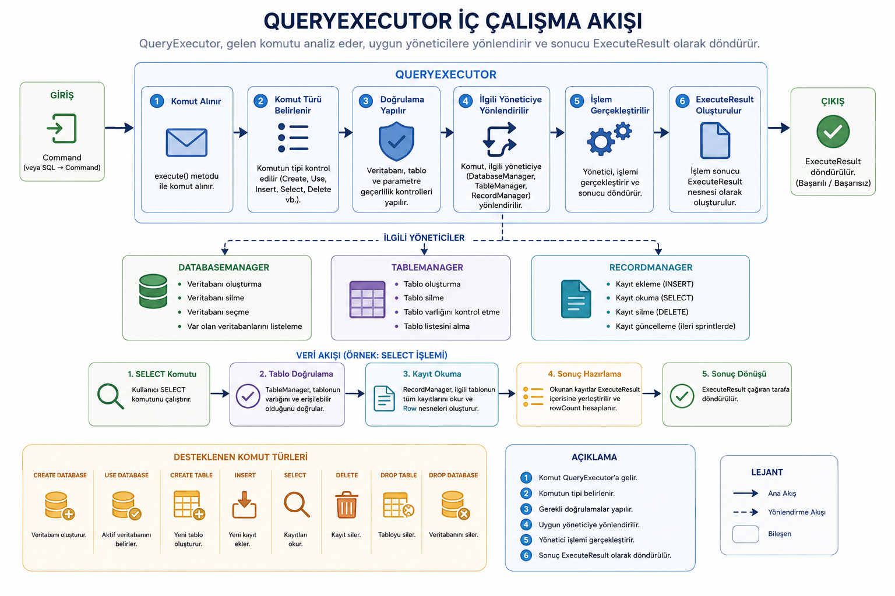
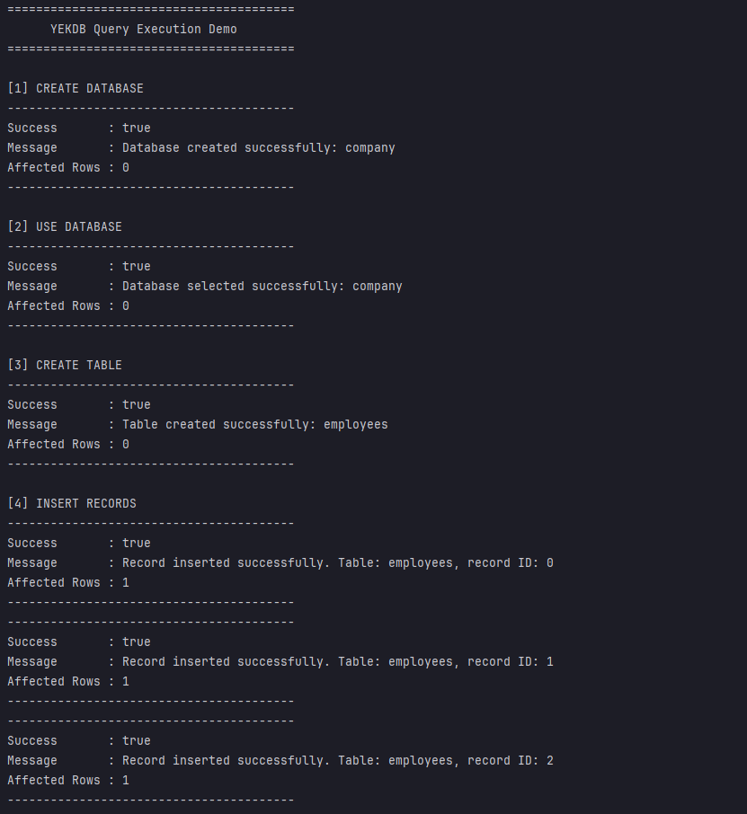
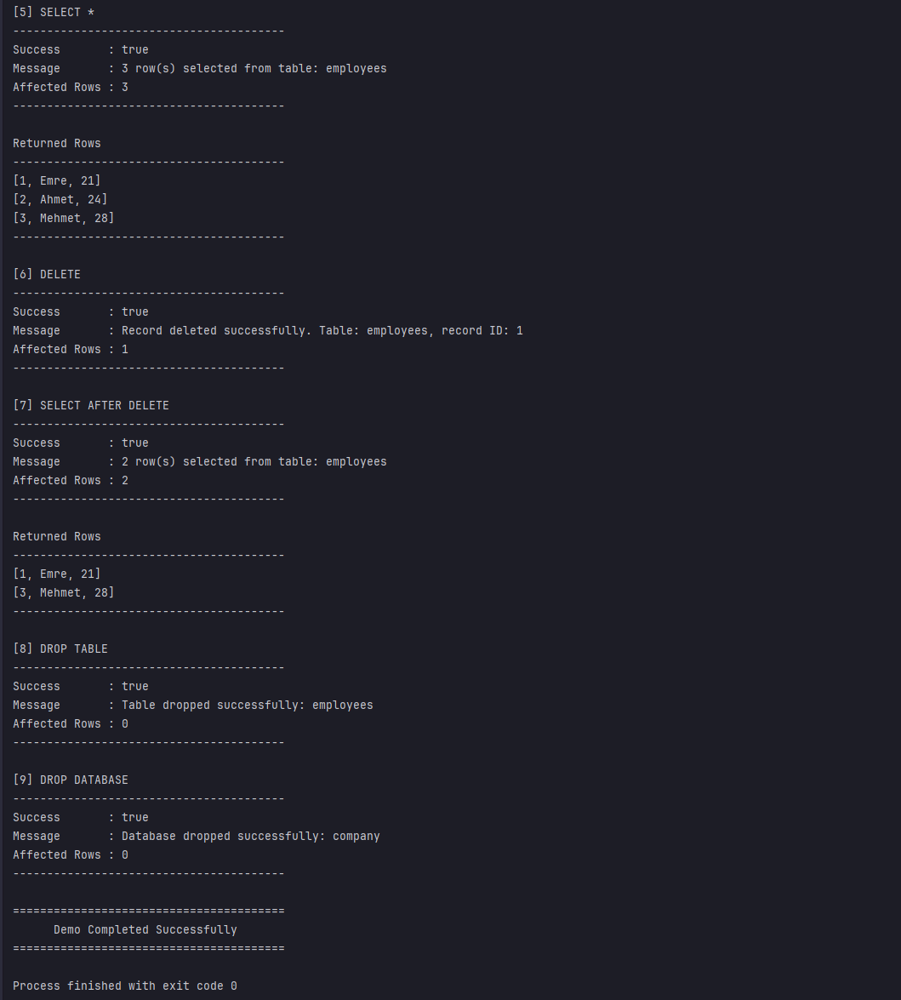
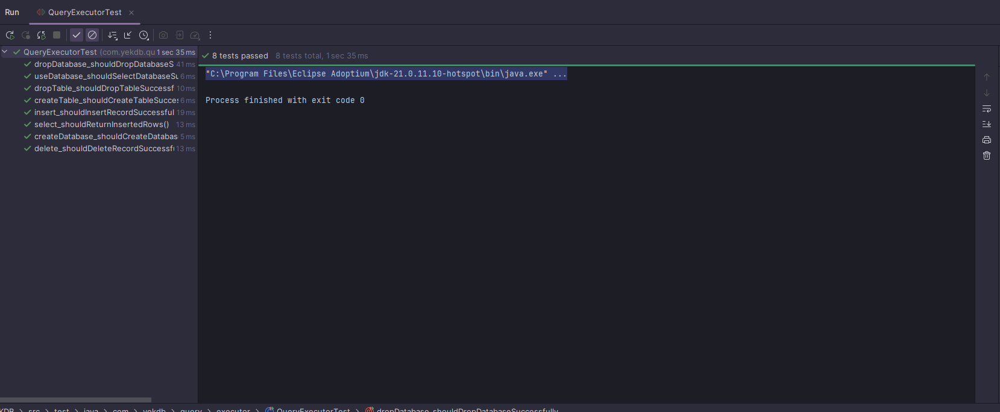
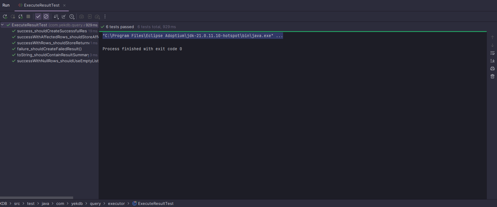
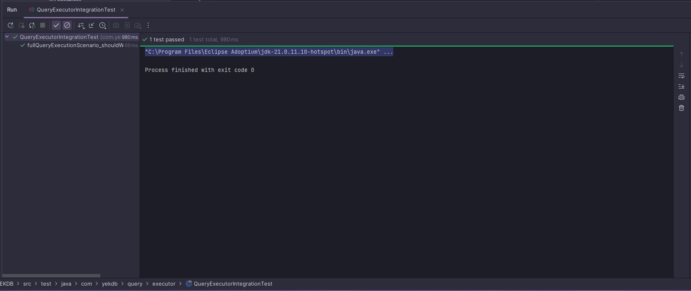

# YEKDB
## Yet Another Embedded Key Database

> A lightweight relational database management system written entirely in Java.


---

# 📖 About

YEKDB (Yet Another Embedded Key Database) is a relational database management system (RDBMS) written completely from scratch in Java.

Unlike educational database projects built on existing engines, YEKDB independently implements every major subsystem including:

- Physical Storage Engine
- Record Management
- Database Management
- Table Management
- Index Management
- SQL Query Execution

The primary objective of the project is to understand how modern relational database systems work internally while building a fully functional database engine from the ground up.

---

# ✨ Features

## Storage Engine

- Physical Page Management
- Binary DataFile Format
- Database Header
- Page Header
- Record Storage
- Record Serialization

---

## Database Engine

- Database Management
- Table Management
- Record Management
- Index Management

---

## Query Engine

Sprint 00-10 introduces the first complete query execution infrastructure.

Implemented components:

- SQL Tokenizer
- SQL Parser
- Statement Model
- Statement → Command Mapper
- Query Executor
- Execute Result Model

---

# Supported Operations

## SQL Statements

```sql
INSERT INTO employees VALUES (1,'Emre',21);

SELECT * FROM employees;

DELETE FROM employees
WHERE record_id = 0;
```

---

## Management Commands

Currently supported through the internal command system.

- CREATE DATABASE
- USE DATABASE
- CREATE TABLE
- DROP TABLE
- DROP DATABASE

---

# Query Execution Architecture

```
                    SQL Statement
                          │
                          ▼
                  SQL Tokenizer
                          │
                          ▼
                    SQL Parser
                          │
                          ▼
                 Statement Objects
                          │
                          ▼
             StatementCommandMapper
                          │
                          ▼
                     Command Objects
                          │
                          ▼
                    QueryExecutor
              ┌───────────┼───────────┐
              ▼           ▼           ▼
      DatabaseManager  TableManager  RecordManager
                                      │
                                      ▼
                                 PageManager
                                      │
                                      ▼
                                   DataFile
                                      │
                                      ▼
                                Physical Storage
```

---

# 📸 Screenshots

## Query Execution Architecture

<p align="center">

</p>

---

## QueryExecutor Internal Workflow

<p align="center">

</p>

---

## Query Execution Demo

<p align="center">

</p>

<p align="center">

</p>

---

## QueryExecutor Tests

<p align="center">

</p>

---

## ExecuteResult Tests

<p align="center">

</p>

---

## Integration Test

<p align="center">

</p>

---

# 🧪 Testing

| Test Suite | Result |
|------------|:------:|
| QueryExecutorTest | ✅ 8 / 8 |
| ExecuteResultTest | ✅ 6 / 6 |
| QueryExecutorIntegrationTest | ✅ 1 / 1 |

**Total**

```
15 Tests Passed
```

---

# 📂 Project Structure

```
YEKDB
│
├── config
├── data
├── docs
│   ├── screenshots
│   └── documentation
├── logs
├── src
│   ├── catalog
│   ├── config
│   ├── database
│   ├── exception
│   ├── index
│   ├── logging
│   ├── query
│   ├── storage
│   ├── table
│   └── util
└── pom.xml
```

---

# 📈 Development Progress

| Sprint | Status |
|----------|:------:|
| 00-01 | ✅ |
| 00-02 | ✅ |
| 00-03 | ✅ |
| 00-04 | ✅ |
| 00-05 | ✅ |
| 00-06 | ✅ |
| 00-07 | ✅ |
| 00-08 | ✅ |
| 00-09 | ✅ |
| **00-10 Query Execution Foundation** | ✅ |

---

# 🚀 Next Sprint

Sprint 00-11

Planned features:

- UPDATE Execution
- WHERE Expression Engine
- Predicate Evaluation
- Expression Tree
- Query Optimization Foundation

---

# ⚙ Requirements

- Java 21
- Maven 3.x
- IntelliJ IDEA

---

# 📄 License

This project is licensed under the MIT License.

---

# 👨‍💻 Author

**Yunus Emre KUL**

Computer Engineering Student

Developing a relational database management system completely from scratch in Java.