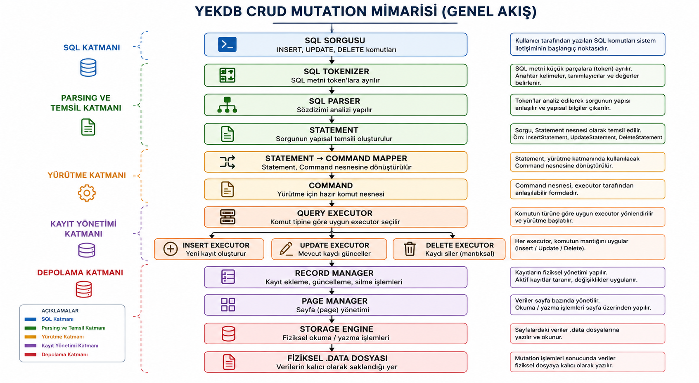
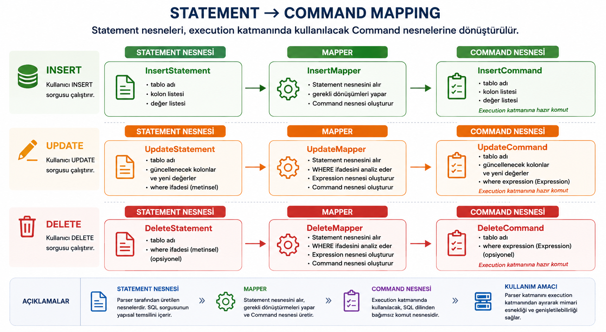
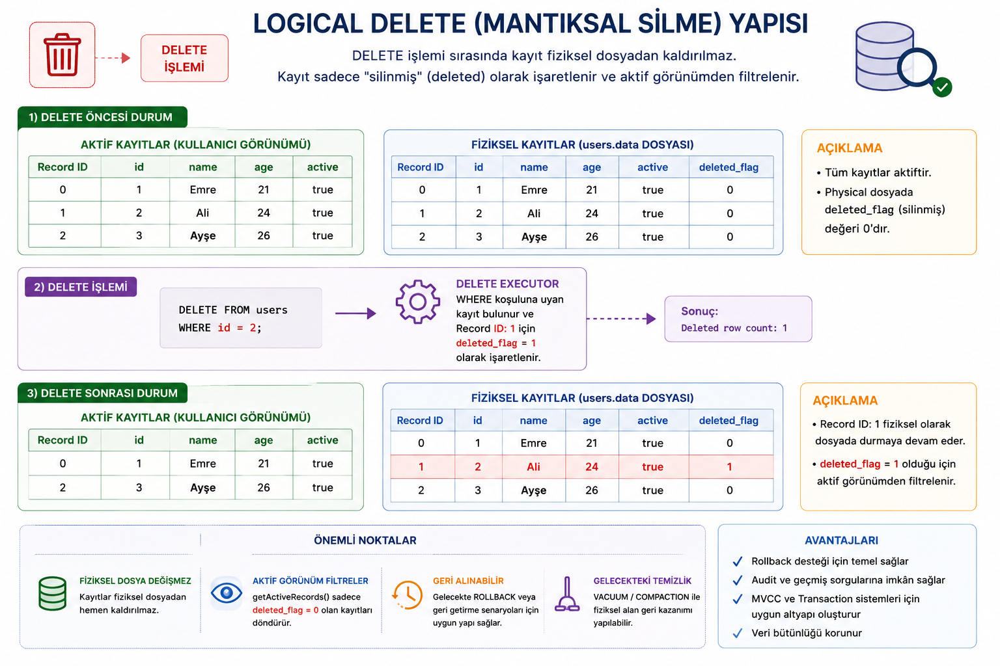

# YEKDB
### Yet Another Embedded Key Database

> An educational relational database management system built from scratch in Java 21, with its own physical storage and query execution architecture.


---

# 📖 About the Project

**YEKDB** is an educational relational database management system developed without relying on an existing database engine in the background.

The project is not based on the source code or storage engine of systems such as:

- PostgreSQL
- MySQL
- SQLite

The main goal is to understand how modern database systems work internally by designing and implementing their core components independently.

The project focuses on areas such as:

- Physical Storage Engine
- Page Management
- Record Management
- Table Management
- Index Management
- SQL Parser
- Expression Engine
- Query Execution Engine
- CRUD Operations
- Transaction Management
- Client / Server Architecture

YEKDB can currently store records in its own physical `.data` files and persistently execute INSERT, UPDATE, and DELETE operations starting directly from SQL text.

---

# 🚀 Sprint 00-12 Status

Sprint 00-12 completes the fundamental data mutation layer of YEKDB.

## Completed CRUD Capabilities

| Feature | Status |
|---|---|
| INSERT | ✅ |
| UPDATE | ✅ |
| DELETE | ✅ |
| WHERE-based mutations | ✅ |
| SQL Parser integration | ✅ |
| Statement → Command mapping | ✅ |
| Physical persistence | ✅ |
| Logical DELETE | ✅ |
| Integration tests | ✅ |
| CRUD mutation demo | ✅ |

---

# 🧠 Current Query Architecture

SQL statements are not sent directly to the storage layer.

They pass through the following execution pipeline:

```text
SQL
 │
 ▼
SqlTokenizer
 │
 ▼
SqlParser
 │
 ▼
Statement
 │
 ▼
StatementCommandMapper
 │
 ▼
Command
 │
 ▼
QueryExecutor
 │
 ├── InsertExecutor
 ├── UpdateExecutor
 ├── DeleteExecutor
 └── SelectExecutor
 │
 ▼
RecordManager
 │
 ▼
PageManager
 │
 ▼
StorageEngine
 │
 ▼
.data File
```

This architecture keeps SQL parsing, query execution, and physical storage responsibilities separated from each other.

---

# 🗄️ Physical Storage

YEKDB separates table schema information from physical row storage.

Example:

```text
users.tbl
users.data
```

### `.tbl`

Stores table schema information.

Example:

```text
id INT
name STRING
age INT
active BOOLEAN
```

### `.data`

Stores physical table records using the page-based storage architecture.

Records are not stored using Java object serialization or an external database engine.

YEKDB uses its own:

- Page
- Record
- Row
- RecordSerializer
- PageManager
- RecordManager

infrastructure.

---

# ➕ INSERT

Sprint 00-12 introduces real physical INSERT execution.

Example:

```sql
INSERT INTO users
(id, name, age, active)
VALUES
(1, 'Emre', 21, true);
```

Execution flow:

```text
INSERT SQL
   ↓
InsertStatement
   ↓
InsertCommand
   ↓
InsertExecutor
   ↓
Row
   ↓
RecordManager.insert()
   ↓
users.data
```

INSERT execution validates:

- target table
- column names
- duplicate columns
- value types
- physical schema order

before writing the row into storage.

---

# ✏️ UPDATE

YEKDB can update persisted records directly through SQL.

Example:

```sql
UPDATE users
SET age = 22,
    active = false
WHERE id = 1;
```

Execution flow:

```text
UPDATE SQL
   ↓
UpdateStatement
   ↓
UpdateMapper
   ↓
ExpressionParser
   ↓
UpdateCommand
   ↓
UpdateExecutor
   ↓
WHERE Evaluation
   ↓
RecordManager.update()
   ↓
users.data
```

UPDATE operations are not limited to in-memory changes.

Updated rows are written back to the physical `.data` file, and the new values remain available after the Storage Engine is closed and reopened.

---

# 🗑️ DELETE

DELETE operations use a **logical delete** strategy.

Example:

```sql
DELETE FROM users
WHERE id = 2;
```

Execution flow:

```text
DELETE SQL
   ↓
DeleteStatement
   ↓
DeleteMapper
   ↓
ExpressionParser
   ↓
DeleteCommand
   ↓
DeleteExecutor
   ↓
WHERE Evaluation
   ↓
RecordManager.delete()
```

Deleted records are not immediately removed from the physical data file.

Instead, the record is marked as deleted and is no longer returned by:

```java
recordManager.getActiveRecords()
```

This approach provides a foundation for future systems such as:

- Transactions
- Rollback
- MVCC
- Vacuum / Compaction

---

# 🔍 WHERE Expression Engine

UPDATE and DELETE reuse the WHERE expression infrastructure.

Examples:

```sql
WHERE id = 1
```

```sql
WHERE age > 18
```

```sql
WHERE score >= 75.5
```

```sql
WHERE active = true
```

Currently supported comparison operators:

```text
=
!=
>
<
>=
<=
```

The expression layer prevents the execution engine from depending directly on raw SQL text.

---

# 🧪 CRUD Mutation Demo

At the end of Sprint 00-12, an end-to-end CRUD mutation demo was completed successfully.

Demo flow:

```text
CREATE DATABASE
       ↓
USE DATABASE
       ↓
CREATE TABLE
       ↓
INSERT × 3
       ↓
UPDATE
       ↓
DELETE
       ↓
Storage Engine Shutdown
       ↓
Storage Engine Reopen
       ↓
Physical Persistence Verification
```

The demo creates three records:

```text
Record ID: 0
Record ID: 1
Record ID: 2
```

Then executes:

```sql
UPDATE users
SET age = 22,
    active = false
WHERE id = 1;
```

Result:

```text
Updated row count: 1
```

After that:

```sql
DELETE FROM users
WHERE id = 2;
```

Result:

```text
Deleted row count: 1
```

After reopening the physical storage file:

```text
Active record count: 2
```

This confirms that INSERT, UPDATE, and DELETE operations are persisted through the physical storage layer.

---

# 🖼️ Sprint 00-12 Architecture Visuals

The following diagrams document the internal CRUD mutation architecture introduced in Sprint 00-12.

## CRUD Mutation Architecture

This diagram shows the complete mutation pipeline from SQL input to physical `.data` storage.



---

## Statement → Command Mapping

This diagram shows how parser-generated Statement objects are transformed into execution-ready Command objects.



---

## INSERT Execution Flow

This diagram explains how an INSERT statement is parsed, validated, converted into a Row, and written to the physical storage layer.


---

## UPDATE Execution Flow

This diagram shows how UPDATE reuses the Expression infrastructure for WHERE evaluation before modifying the persisted record.


---

## Logical DELETE Structure

This diagram explains YEKDB's logical delete strategy, where deleted records remain physically stored but are filtered out from active record views.



---

# 🧪 Testing

YEKDB uses **JUnit 5**.

Tests cover both component-level behavior and physical persistence.

Sprint 00-12 includes the following scenarios:

### INSERT

```text
SQL INSERT
→ Record creation
→ Write to .data file
```

### UPDATE

```text
INSERT
→ UPDATE
→ Close Storage Engine
→ Reopen Storage Engine
→ Verify updated Row
```

### DELETE with WHERE

```text
INSERT
→ DELETE WHERE
→ Reopen Storage Engine
→ Active records = 0
```

### DELETE with no matching row

```text
DELETE WHERE id = 999
→ Deleted row count = 0
→ Existing row remains active
```

### DELETE ALL

```sql
DELETE FROM users;
```

Expected result:

```text
Active records = 0
```

Run all tests with:

```bash
mvn clean test
```

---

# 🏗️ Main Modules

The current project structure includes the following major modules:

```text
com.yekdb
│
├── core
├── database
├── table
├── storage
│   ├── page
│   └── record
│
├── index
│
└── query
    ├── command
    ├── datasource
    ├── evaluator
    ├── executor
    ├── expression
    ├── mapper
    ├── optimizer
    ├── parser
    ├── result
    └── statement
```

---

# 📦 Query Layer

The query layer is separated by responsibility.

## command

Contains executable query models.

```text
InsertCommand
UpdateCommand
DeleteCommand
SelectCommand
```

## statement

Contains SQL models produced by the parser.

```text
InsertStatement
UpdateStatement
DeleteStatement
SelectStatement
```

## parser

Processes SQL text.

```text
SqlTokenizer
SqlParser
ExpressionParser
```

## mapper

Transforms Statement objects into execution-ready Command objects.

```text
StatementCommandMapper
InsertMapper
UpdateMapper
DeleteMapper
SelectMapper
```

## executor

Contains the actual execution logic.

```text
QueryExecutor
InsertExecutor
UpdateExecutor
DeleteExecutor
SelectExecutor
TableScanExecutor
```

## expression

Contains the execution model used by WHERE conditions.

```text
Expression
ComparisonExpression
ComparisonOperator
LogicalExpression
LogicalOperator
NotExpression
```

---

# 📚 Sprint History

## Sprint 00-01
- Initial architecture
- Java 21
- Maven
- Git / GitHub
- Initial package structure

## Sprint 00-02
- Core Engine
- Storage Engine architecture

## Sprint 00-03
- Configuration
- Logger
- Page structure

## Sprint 00-04
- Page Serialization
- Page Manager
- Record foundation

## Sprint 00-05
- Physical Storage Engine
- DataFile
- DatabaseHeader
- Page persistence

## Sprint 00-06
- Database Management
- Database metadata
- Database lifecycle

## Sprint 00-07
- Table Management
- Column
- DataType
- TableCatalog
- TableManager

## Sprint 00-08
- Row
- RowSerializer
- RecordManager

## Sprint 00-09
- Index foundation
- RecordPointer
- IndexMetadata
- Index
- IndexManager

## Sprint 00-10
- Query Execution Foundation
- Command infrastructure
- ExecuteResult
- QueryExecutor foundation

## Sprint 00-11
- SELECT execution
- WHERE expression infrastructure
- Query evaluation
- Table scan
- Query optimizer foundation

## Sprint 00-12
- INSERT execution
- UPDATE execution
- DELETE execution
- SQL Parser integration
- Statement → Command mapping
- WHERE-based mutations
- Physical persistence
- Logical delete
- CRUD integration tests
- CRUD mutation demo
- Architecture documentation

---

# 🛣️ Roadmap

YEKDB is still under active development.

## Query Engine

- [x] SQL Tokenizer
- [x] SQL Parser
- [x] SELECT foundation
- [x] INSERT
- [x] UPDATE
- [x] DELETE
- [x] Basic WHERE
- [ ] AND / OR / NOT extensions
- [ ] ORDER BY
- [ ] LIMIT
- [ ] Aggregate Functions
- [ ] JOIN

## Storage Engine

- [x] Page-based storage
- [x] Record persistence
- [x] Physical INSERT
- [x] Physical UPDATE
- [x] Logical DELETE
- [ ] Free Space Manager
- [ ] Deleted record compaction
- [ ] Buffer Pool

## Index

- [x] Index foundation
- [x] RecordPointer
- [x] Index metadata
- [ ] B+ Tree
- [ ] Index-assisted SELECT
- [ ] Index-assisted UPDATE / DELETE

## Transaction System

- [ ] BEGIN
- [ ] COMMIT
- [ ] ROLLBACK
- [ ] Write Ahead Logging
- [ ] Crash Recovery
- [ ] Isolation
- [ ] MVCC

## Database Features

- [ ] Constraints
- [ ] Primary Key
- [ ] Unique
- [ ] Foreign Key
- [ ] Views
- [ ] Triggers
- [ ] Stored Procedures
- [ ] Backup / Restore

## Client / Server

- [ ] TCP Server
- [ ] Multi-user architecture
- [ ] Authentication
- [ ] Role management
- [ ] Desktop client
- [ ] Remote connections

---

# ⚙️ Requirements

Recommended environment:

```text
JDK 21+
Apache Maven 3.x
Git
```

---

# 🔨 Build

Clone the repository:

```bash
git clone https://github.com/EmreBEYS/YEKDB.git
```

Enter the project directory:

```bash
cd YEKDB
```

Run tests:

```bash
mvn clean test
```

Build the project:

```bash
mvn clean package
```

---

# 🎯 Project Goal

The goal of YEKDB is not to use an existing database engine, but to implement and understand the complete database execution path:

```text
SQL
↓
Parser
↓
Execution Engine
↓
Record Manager
↓
Page Manager
↓
Storage Engine
↓
Disk
```

The project therefore focuses heavily on:

- data structures
- file systems
- algorithms
- query execution
- disk management
- indexing
- transaction systems

---

# 📄 License

This project is developed for educational and research purposes.

See:

```text
LICENSE
```

for license information.

---

# 👨‍💻 Developer

**Yunus Emre KUL**

Computer Engineering

GitHub:

**EmreBEYS**

---

> YEKDB is built from scratch to understand how database management systems work internally.
