# YEKDB
### Yet Another Embedded Key Database

> Sprint 00-11 – Query Execution Engine


---

# 📖 About

Sprint 00-11 introduces the first fully functional **Query Execution Engine** inside YEKDB.

This sprint adds the infrastructure required to evaluate SQL WHERE clauses, build logical expression trees, execute SELECT statements, perform table scans and return query results.

The system now supports complete execution of basic SELECT queries with filtering using AND, OR and NOT logical operators.

---

# ✨ Features

## Query Execution Engine

- SQL Query Execution
- Query Dispatcher
- Query Result Generation
- Execution Statistics

---

## Expression Engine

- ComparisonExpression
- LogicalExpression
- NotExpression

Supported Operators

- =
- !=
- >
- >=
- <
- <=

Logical Operators

- AND
- OR
- NOT

---

## WHERE Engine

- WHERE Evaluation
- Predicate Evaluation
- Boolean Expression Tree
- Nested Logical Expressions

---

## Table Scan

- Sequential Scan
- Row Filtering
- Expression Matching
- Result Collection

---

## Select Executor

Supported

```sql
SELECT * FROM users;

SELECT * FROM users
WHERE age > 18;

SELECT * FROM users
WHERE age > 18
AND city = 'Malatya';

SELECT * FROM users
WHERE city = 'Ankara'
OR city = 'Istanbul';

SELECT * FROM users
WHERE NOT active = true;
```

---

# 🧪 Testing

Sprint 00-11 includes comprehensive unit and integration tests.

### Successfully Tested

- QueryExecutor
- QueryExecutorIntegration
- PredicateEvaluator
- Expression
- WhereEvaluator
- RowValueProvider
- QueryResult
- SelectCommand
- SelectExecutor
- TableScanExecutor

Current project status

```
506 JUnit Tests Passed
```

Verified using

```bash
mvn clean test
```

---

# 📂 Package Structure

```
query
│
├── command
├── datasource
├── evaluator
├── executor
├── expression
├── mapper
├── optimizer
├── parser
├── result
└── statement
```

---

# 📸 Demo Screenshots

## Query Execution Demo

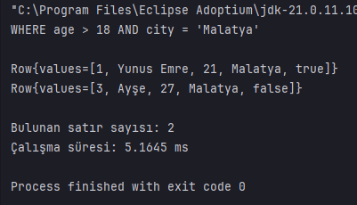

---

## Query Execution Demo (WHERE)

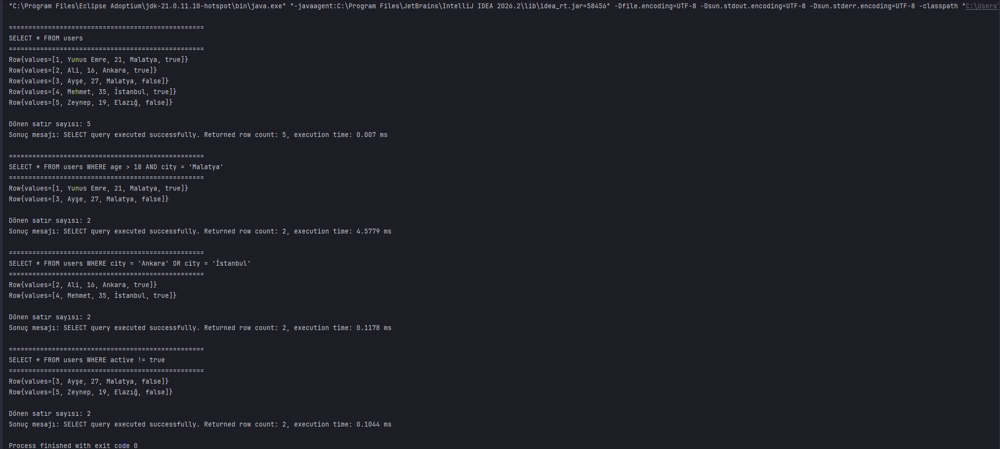

---

## Expression Demo

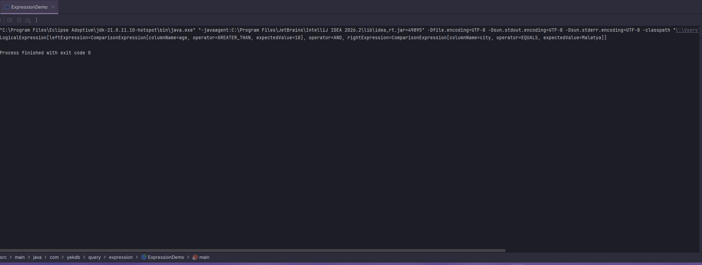

---

## Predicate Evaluator Demo

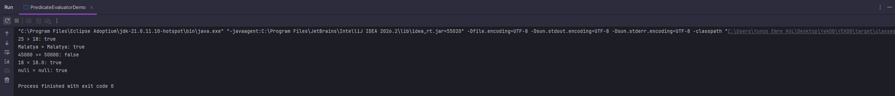

---

## Row WHERE Evaluator Demo


---

## Select Executor Demo

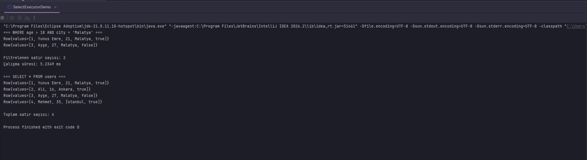

---

## Table Scan Executor Demo

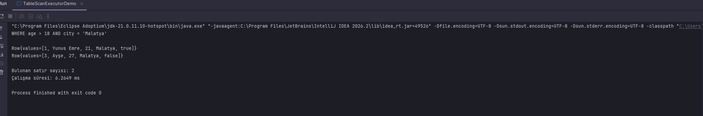

---

# 🧪 Unit Tests

## Expression Tests

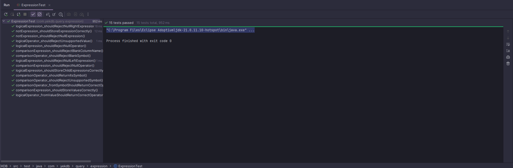

---

## PredicateEvaluator Tests


---

## Query Executor Integration Tests

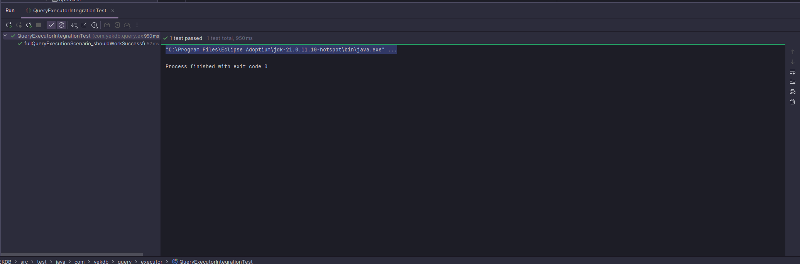

---

## Query Result Tests

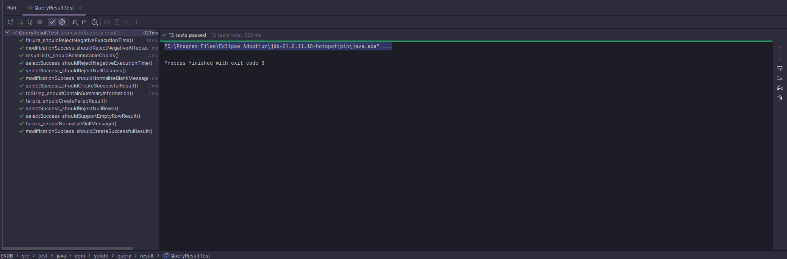

---

## RowValueProvider Tests

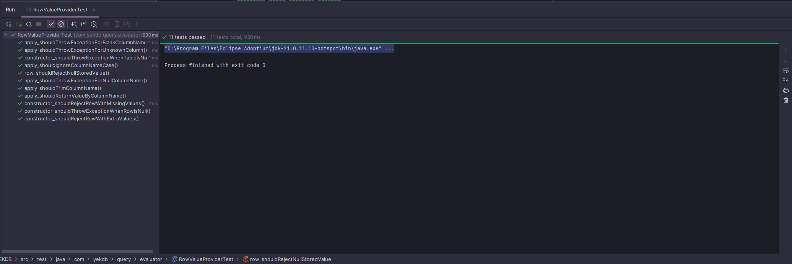

---

## Select Command Tests

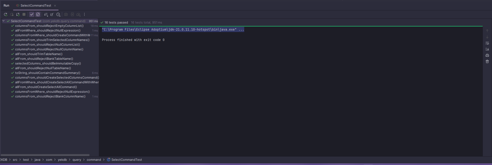

---

## Select Executor Tests

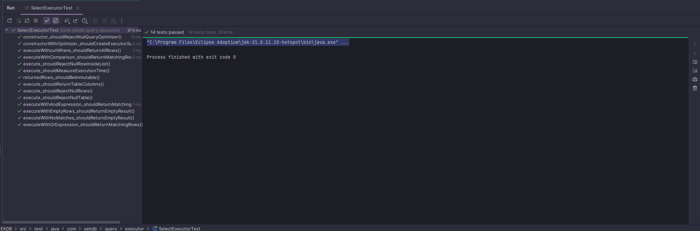

---

## Table Scan Executor Tests

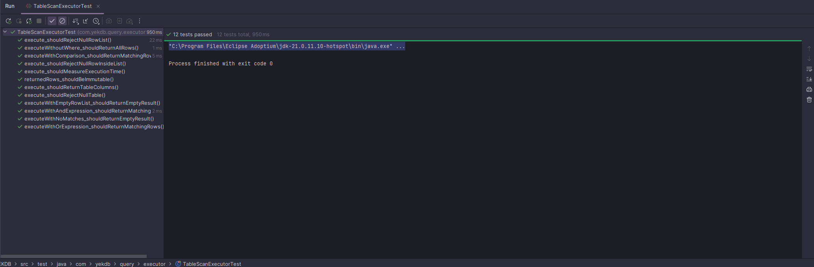

---

## Where Evaluator Tests

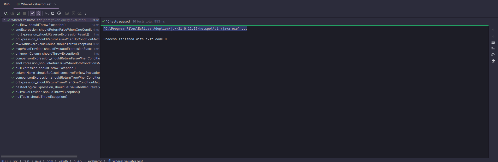

---

## Generic Project Tests

### Maven Build

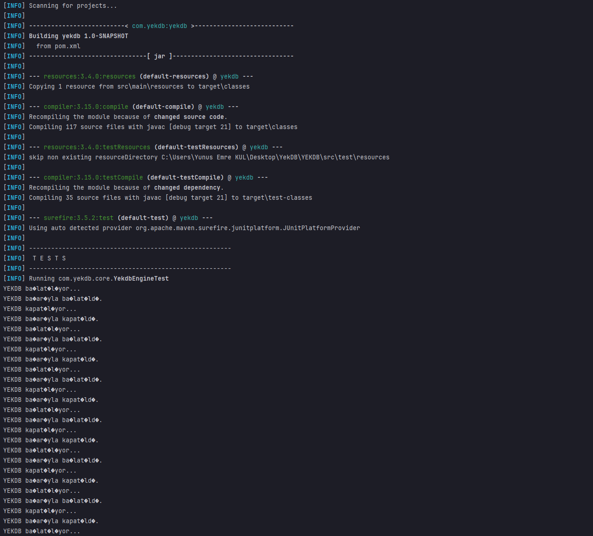

---

### Maven Clean Test

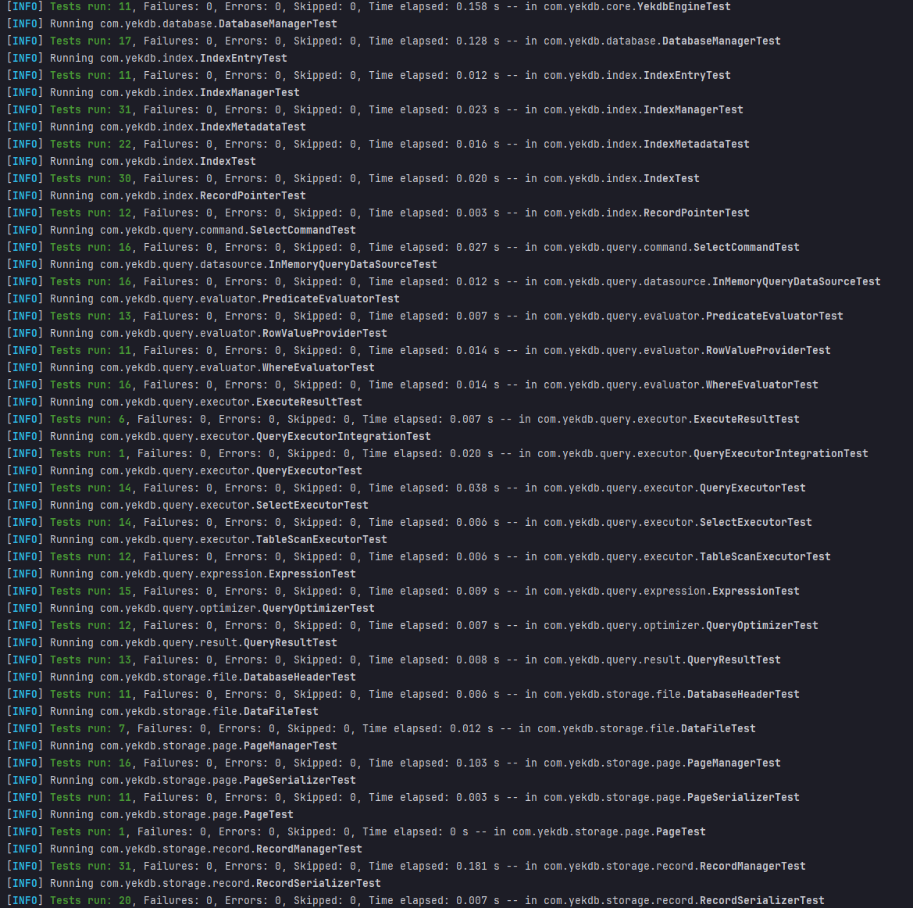

---

### InMemoryQueryDataSource Tests

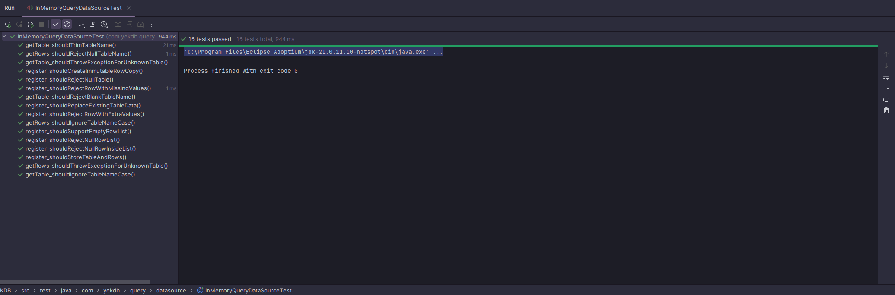

---

# 📚 Documentation

Sprint documentation

- YEKDB_Developer_Notes_00-11.pdf
- YEKDB_00-11_Query_Execution_Engine.pdf

---

# 🚀 Completed Modules

- ✅ Core Engine
- ✅ Physical Storage Engine
- ✅ Database Management
- ✅ Table Management
- ✅ Record Management
- ✅ Index Management
- ✅ Query Execution Engine

---

# 🔜 Next Sprint

Sprint 00-12

Planned features

- SQL Parser Improvements
- Projection (SELECT column1, column2)
- ORDER BY
- LIMIT
- Query Optimizer
- Index Scan
- Execution Plan

---

# 👨‍💻 Developer

**Yunus Emre KUL**

Computer Engineering Student

YEKDB is developed completely from scratch for educational and research purposes to understand the internal architecture of modern relational database systems.

---

# License

MIT License